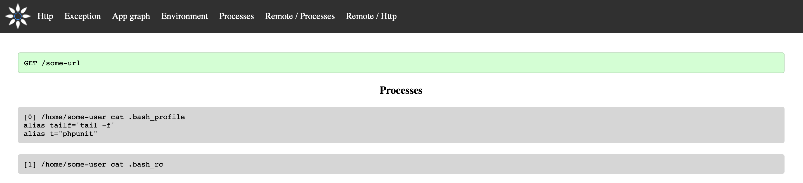
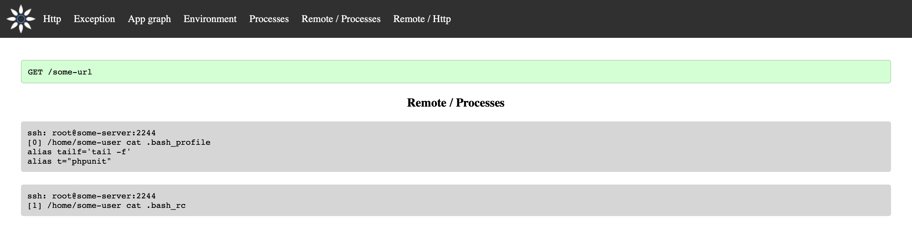

# Profiler

Innmind comes with an optional profiler to help you debug your program.

!!! success ""
    It works for both HTTP (sync or async) and CLI programs.

## Installation

```sh
composer require --dev innmind/debug:~4.0
```

## Usage

```php
use Innmind\Framework\{
    Application,
    Main\Http,
    Middleware\Optional,
};
use Innmind\Profiler\Web\Kernel as Profiler;
use Innmind\Debug\Kernel as Debug;
use Innmind\Url\Path;

new class extends Http {
    protected function configure(Application $app): Application
    {
        return $app
            ->map(Optional::of(
                Debug::class,
                static fn() => Debug::inApp()->operatingSystem(), #(1)
            ))
            ->map(new MyMiddleware)
            ->map(Optional::of(
                Profiler::class,
                static fn() => Profiler::inApp(Path::of('var/profiler/')), #(2)
            ))
            ->map(Optional::of(
                Debug::class,
                static fn() => Debug::inApp()->app(), #(3)
            ));
    }
};
```

1. This will record every calls made to the Operating System.
2. This exposes the profiler's HTTP routes. The path is where the profiles will be stored.
3. This will record the incoming HTTP requests and CLI commands and their results.

!!! note ""
    The `Optional` middleware will not call the underlying middleware if the class doesn't exist. This allows to automatically not declare the profiler in production, since it's a composer _dev_ dependency.

You can then access the profiler via `GET /_profiler/`. It will show the list of recorded profiles:


:material-checkbox-blank-circle:{ style="color: rgb(104, 255, 101) " } is successful, :material-checkbox-blank-circle:{ style="color: rgb(255, 179, 48) " } is still running and :material-checkbox-blank-circle:{ style="color: rgb(255, 79, 86) " } failed.

This profiler's advantages is that you can see the profiles while it's being recorded. This means that you don't have to wait for a long CLI command to finish to see what happened.

The other advantage is the way profiles are stored: in a human readable way. If your program does a lot of things (like hundreds of HTTP calls) you can browse the profile's folder and look around individual calls.

??? Tip "Screenshots"
    === "HTTP"
        

    === "Exception"
        

        !!! warning ""
            You need to have [graphviz](https://graphviz.org) installed to view this.

    === "App graph"
        

        This is the object tree loaded to respond to a request/command.

        !!! warning ""
            You need to have [graphviz](https://graphviz.org) installed to view this.

    === "Environment"
        

    === "Processes"
        

    === "Remote Processes"
        

    === "Remote HTTP"
        
