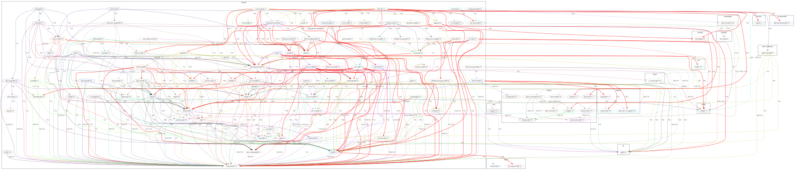
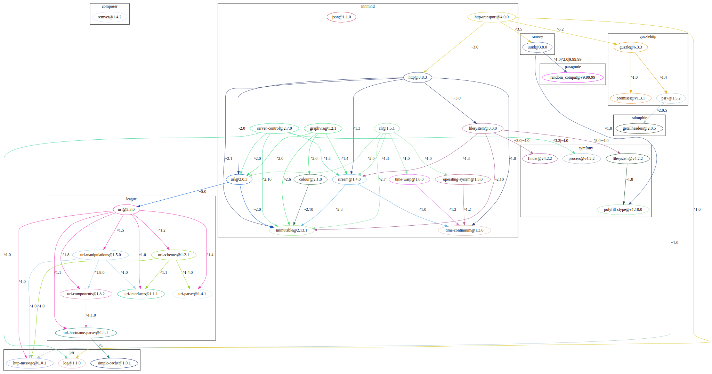
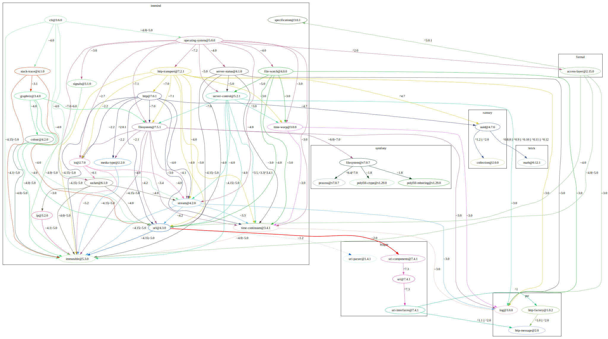
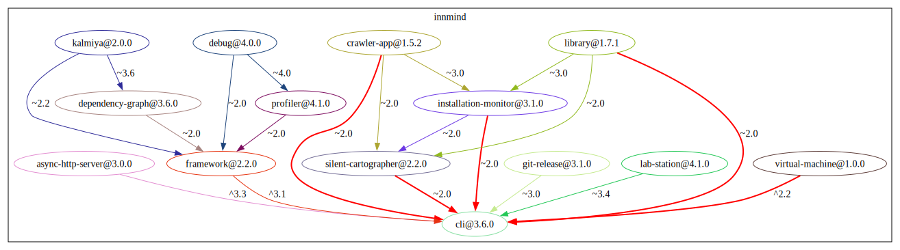
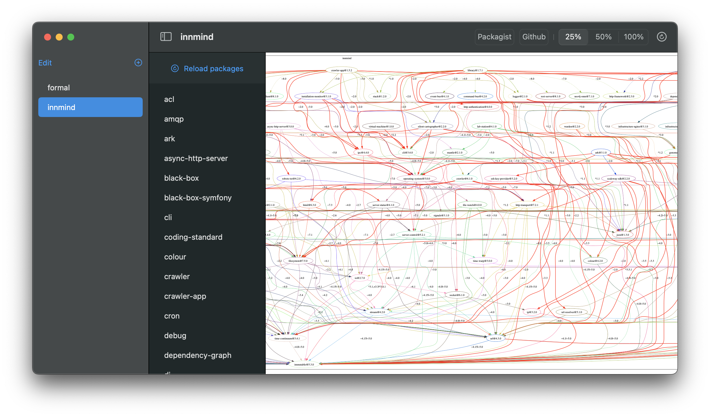

---
hide:
    - navigation
---

# Tools

All the examples below assume that the folder `~/.composer/vendor/bin` is part of your `$PATH` environment variable.

## Dependency graph

This tool helps to visualize all the dependencies of a package or an organization. The main feature is that it highlight the dependencies that are out of date.

This ease the development on Innmind to understand in which order to update packages.

### Installation

```sh
composer global require innmind/dependency-graph:~3.5
```

### Usage

=== "Organization"
    ```sh
    dependency-graph vendor innmind
    ```

    

    !!! info ""
        You can see a lot of red because the refactoring to the monadic style is still under way.

=== "From lock"
    ```sh
    cd to/your/project && dependency-graph from-lock
    ```

    

=== "Package dependencies"
    ```sh
    dependency-graph of innmind/cli
    ```

    

=== "Package dependents"
    ```sh
    dependency-graph depends-on innmind/cli innmind
    ```

    

### macOS App

Instead of manually executing the CLI commands you can use this [macOS app](https://github.com/Innmind/macOS-tooling). You only need to specify the organization you want to visualize and the app will fetch everything necessary.



## Lab station

This tool automatically runs your tests, psalm and code style checker everytime you save a file.

### Installation

```sh
composer global require innmind/lab-station:~4.1
```

### Usage

```sh
cd to/package/ && lab-station
```

<video controls>
    <source src="/assets/lab-station/overview.mov">
</video>

## Git release

This is a tool to create [SemVer](https://semver.org) tags.

### Installation

```sh
composer global require innmind/git-release:~3.1
```

### Usage

```sh
git-release major
```

If the last major version is `1.2.3` this will create the tag `2.0.0` and push it to the remote.

There's also the `minor` and `bugfix` commands.
